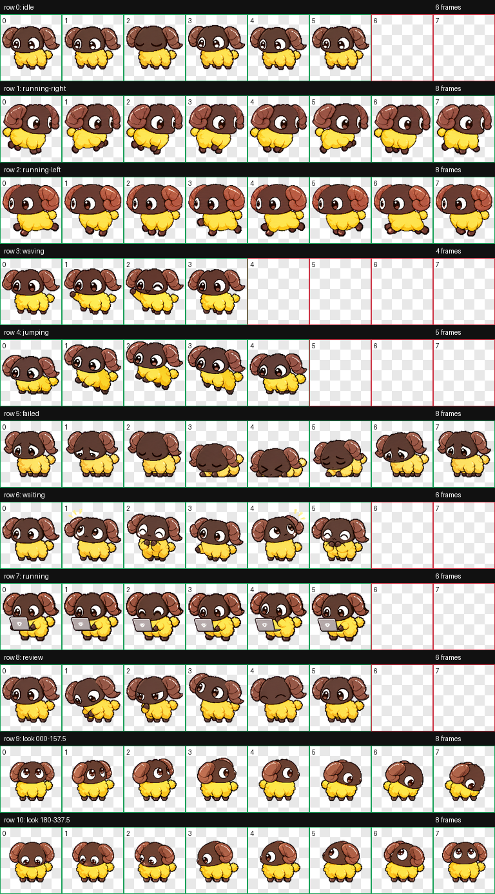

# 斗技场小羊 · Arena Sheep

以 FF14 斗技场小羊为灵感制作的个人非官方像素风桌面宠物素材。深棕色面孔、卷角、金黄色羊毛和短蹄。

## 文件

| 文件 | 规格 | 用途 |
| --- | --- | --- |
| `assets/arena-sheep-v2.png` | 1536×2288，8 列×11 行，每格 192×208，透明 PNG | ChatGPT Work v2，含 9 种动作及 16 个环视方向 |
| `assets/arena-sheep-v1.png` | 1536×1872，8 列×9 行，每格 192×208，透明 PNG | 使用 9 行 Codex 风格图集的第三方桌宠播放器 |
| `assets/gifs/*.gif` | 按状态独立 GIF | 支持逐状态 GIF 的桌宠播放器，亦可用于自定义适配 |

前九行从上到下：`idle`（6 帧）、`running-right`（8）、`running-left`（8）、`waving`（4）、`jumping`（5）、`failed`（8）、`waiting`（6）、`running`（6）、`review`（6）。每行从左向右取有效帧，其余格子透明。v2 第 10、11 行各 8 帧，按从上、右、下、左的顺时针方向连续转头。

## WorkBuddy

WorkBuddy 本身不等于桌宠播放器，需要安装能够读取图集或 GIF 的第三方桌宠扩展。

- [WorkBuddy-pet](https://github.com/xiaoshuxiaofu/WorkBuddy-pet) 文档所列的图集规格为 8 列×9 行、每格 192×208，可尝试使用 `assets/arena-sheep-v1.png` 作为 `--atlas`。该项目的播放逻辑、manifest 和 hooks 以它自身版本为准；尚未在本机 WorkBuddy 实测。
- [workbuddy-pet-factory](https://github.com/LJRSummer/workbuddy-pet-factory) 支持从本地精灵表安装，并允许在 `pet.json` 覆盖行映射。它的默认行顺序与本素材不同，安装时需配置行映射；不要假定传入图片后状态能自动对应。
- 其他播放器可以读取 `assets/gifs/`，自行把 Agent 事件映射到对应状态。仅上传 GitHub 不会自动让所有 Agent 加载宠物。

## 使用和权利说明

此素材是粉丝创作，非 Square Enix 官方素材，也未附带允许再分发原游戏角色设计的授权。请在公开发布前自行确认适用的粉丝作品规则。仓库未声明将原角色形象授权用于商业用途；如需给适配脚本单独选择开源许可证，应与角色素材的权利说明区分。
