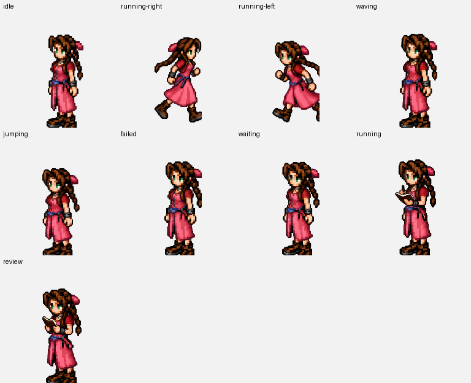

# 斗技场小羊 · Arena Sheep

以 FF14 斗技场小羊为灵感制作的个人非官方像素风桌面宠物素材。深棕色面孔、卷角、金黄色羊毛和短蹄。

## 小羊 · Arena Sheep

| 文件 | 规格 | 用途 |
| --- | --- | --- |
| `assets/sheep/arena-sheep-v2.png` | 1536×2288，8 列×11 行，每格 192×208，透明 PNG | ChatGPT Work v2，含 9 种动作及 16 个环视方向 |
| `assets/sheep/arena-sheep-v1.png` | 1536×1872，8 列×9 行，每格 192×208，透明 PNG | 使用 9 行 Codex 风格图集的第三方桌宠播放器 |
| `assets/sheep/gifs/*.gif` | 按状态独立 GIF | 支持逐状态 GIF 的桌宠播放器，亦可用于自定义适配 |

小羊图集前九行从上到下：`idle`（6 帧）、`running-right`（8）、`running-left`（8）、`waving`（4）、`jumping`（5）、`failed`（8）、`waiting`（6）、`running`（6）、`review`（6）。v2 第 10、11 行各 8 帧，按顺时针方向转头。

## FFVII 爱丽丝 · Aerith

参考你提供的像素图制作的爱丽丝风格桌宠素材。图集为透明 PNG，8 列×9 行，每格 192×208；每种状态含 8 帧。状态顺序：`idle`、`running-right`、`running-left`、`waving`、`jumping`、`failed`、`waiting`、`running`、`review`。

- [爱丽丝精灵图](assets/aerith/spritesheet.png)
- [爱丽丝动画 GIF](assets/aerith/gifs/)

## FFVII 蒂法 · Tifa

参考你提供的蒂法动作条与角色形象制作。资源包已整理为透明 PNG 精灵图，8 列×9 行，每格 192×208；包含 8 个动作来源各 8 帧。仓库标准的第 8 行 `running` 暂时复用 `running-right` 动作。

- [蒂法精灵图](assets/tifa/spritesheet.png)
- [蒂法动画 GIF](assets/tifa/gifs/)

## 使用和权利说明

小羊、爱丽丝和蒂法均为粉丝创作，非 Square Enix 官方素材，也未附带允许再分发原游戏角色设计的授权。请在公开发布前自行确认适用的粉丝作品规则。仓库未声明将原角色形象授权用于商业用途；如需给适配脚本单独选择开源许可证，应与角色素材的权利说明区分。
